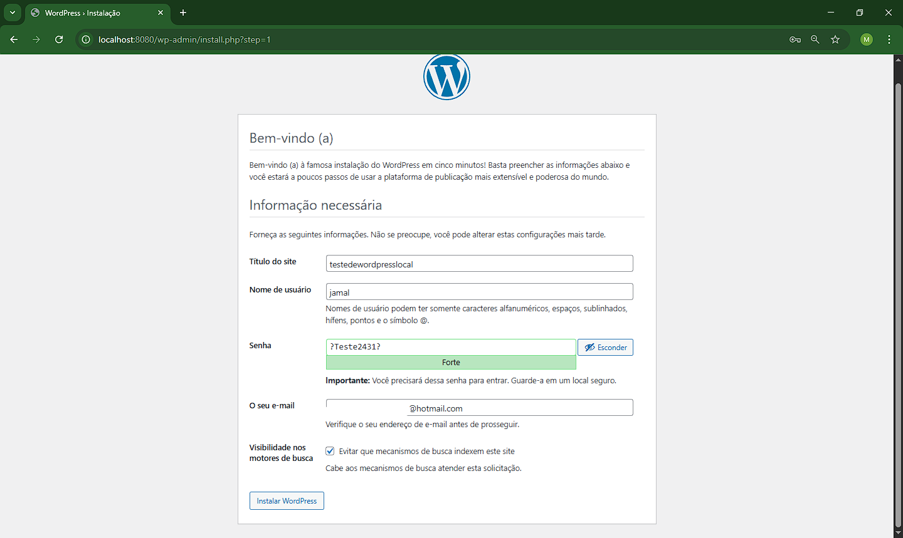
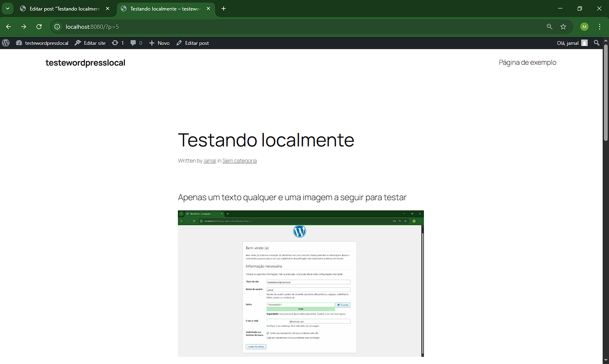
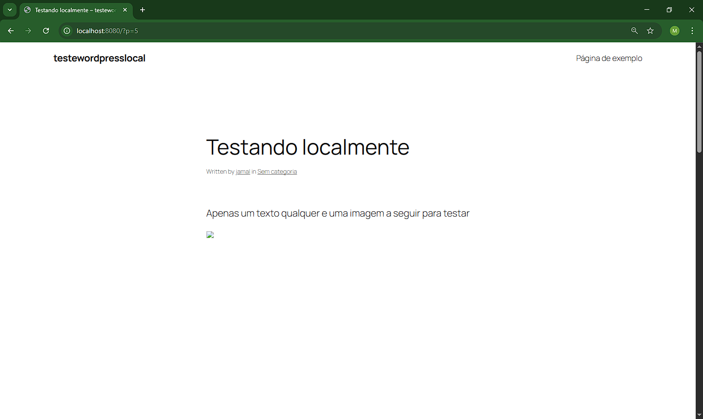

# 📘 WordPress Local

Este ambiente local permite rodar o **WordPress com MySQL** usando **Docker Compose** e **variáveis de ambiente (.env)**. Ele suporta **persistência de dados** usando volumes nomeados para que os dados não sejam perdidos ao reiniciar os containers.

---

## ✅ Objetivos

- Subir um ambiente WordPress com banco de dados MySQL localmente.
- Utilizar `.env` para parametrização.
- Testar a persistência de dados (posts, uploads, configurações).
- Exibir corretamente a **tela de login** do WordPress.

---

## 🧾 Pré-requisitos

- Docker
- Docker Compose

---

## 📁 Estrutura de Arquivos
```sql
📁 1-local
│
├── 📁 img               # Imagens para o README
├── .env                 # Variáveis de ambiente
├── docker-compose.yml   # Configuração do Docker Compose
└── README.md            # Este arquivo
```


## 🚀 Passo a passo

### 1. Criar o arquivo .env

Crie o arquivo .env com as configurações do banco e do WordPress. Este arquivo armazena informações sensíveis como usuário, senha e nome do banco.

### 2. Criar o Docker-compose

Configure os serviços wordpress e mysql com volumes para garantir a persistência de dados.

### 3. Criando/Subindo os containers
Devemos utilizar o seguinte comando para criar os containers e iniciar os serviços definidos no docker-compose.yml:
```bash
docker-compose up -d
```

### 4. Acessando a aplicação
Acesse http://localhost:80.
Você verá a tela de configuração inicial do WordPress:





Após finalizar a instalação e criar um post, você verá algo como:





### 5. Testar de permanência de dados
Use os seguintes comandos verificar se os dados foram salvos corretamente:
```bash
docker-compose down
docker-compose up -d
```
O primeiro comando encerra e remove os containers, o segundo os recria com base no mesmo volume.
Se tudo estiver correto, seus dados continuarão disponíveis. Caso não haja volumes definidos, ao reiniciar os containers, os dados serão perdidos:





## 📌 Considerações finais
Com este ambiente, é possível subir e testar facilmente uma instalação do WordPress com MySQL usando Docker. A utilização de variáveis de ambiente e volumes nomeados torna o projeto mais organizado, permitindo manter a persistência de dados. É uma ótima ideia para estudos e testes locais, ajudando a preparar a mente para desenvolver e aprimorar soluções em projetos mais complexos.