# 📘 Deploy manual AWS

Este ambiente demonstra a implantação manual de um site **WordPress com banco de dados MySQL** utilizando recursos da **AWS**. Ele permite entender o provisionamento de instâncias EC2, banco de dados com RDS, e uso de EFS para armazenamento.

---

## ✅ Objetivos

- Criar uma instância EC2 e instalar Docker/Docker Compose manualmente.
- Subir o WordPress via Docker Compose.
- Utilizar `.env` para parametrização.
- Usar um banco de dados externo no Amazon RDS.
- Montar um volume persistente com Amazon EFS.
- Acessar a tela de login do WordPress via IP público da EC2.

---

## 🧾 Pré-requisitos

- Conta na AWS com permissões para criar EC2, RDS, EFS, VPC e Security Groups.
- Conhecimentos básicos em terminal Linux e Docker.
- Chave PEM de acesso à instância EC2.

---

## 📁 Estrutura de Arquivos
```sql
📁 2-manual-aws
│
├── 📁 img               # Imagens e capturas de tela do projeto
├── .env                 # Variáveis de ambiente com configs de banco
├── docker-compose.yml   # Define os serviços WordPress e MySQL
└── README.md            # Este arquivo
```

---

## 🚀 Passo a passo

Realizaremos manualmente as seguintes configurações na AWS:

- Criação da **VPC** e dos **Security Groups**, definindo regras de acesso.
- Configuração do **EFS (Elastic File System)** para armazenar arquivos persistentes do WordPress, permitindo que os dados sejam mantidos mesmo que a instância EC2 seja interrompida.
- Provisionamento do banco de dados com **RDS MySQL**.
- Criação e configuração da **instância EC2**, onde o WordPress será executado com Docker, acessando o RDS e o EFS.

Essa abordagem permite entender a infraestrutura como um todo antes de automatizá-la.

### 1. Criar VPC (Virtual Private Cloud)

**1.1** - Abra o console e pesquise por **VPC** na aba de pesquisa

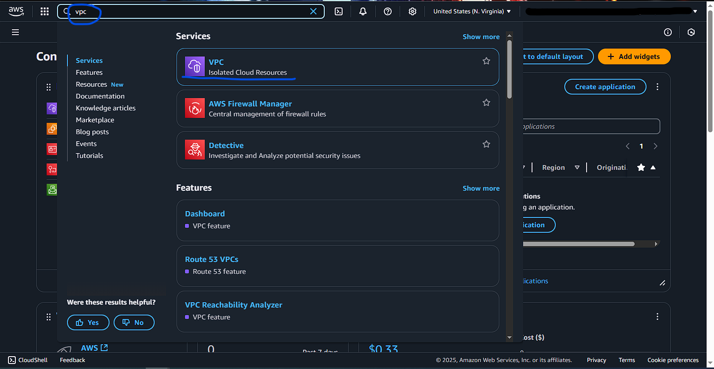

**1.2** - No menu ao lado esquerdo clique em **Your VPCs**, depois em **Create VPC** na parte superior direita

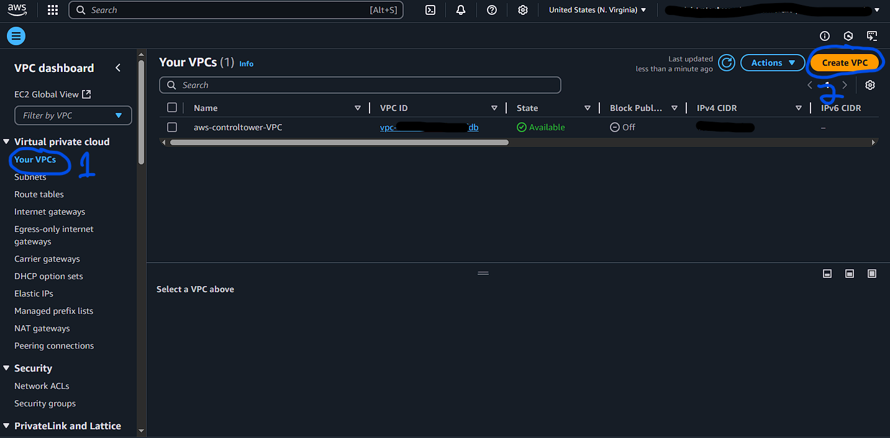

**1.3** - Nas configurações selecione:

- **VPC and more**
- **Name**: defina um nome para a VPC
- **IPv4 CIDR block**: `10.0.0.0/16`
- **IPv6 CIDR block**: selecione **No IPv6 CIDR block**
- **Availability Zones**: 2
- **Public subnets**: 2
- **Private subnets**: 2
- **NAT gateways**: In 1 AZ
- **VPC endpoints**: S3 Gateway
- **Enable DNS hostnames**
- **Enable DNS resolution**

Clique em **Create VPC**

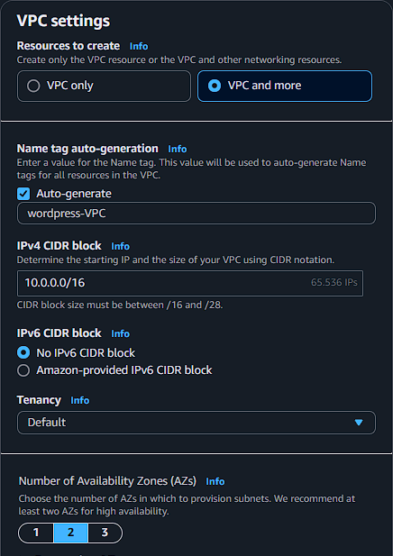
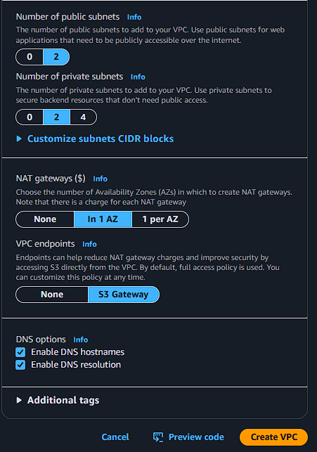

---

### 2. Criar Security Group

#### **2.1** Security Group da EC2

**2.1.1** - Abra o console e pesquise por **VPC** na aba de pesquisa


**2.1.2** - No menu ao lado esquerdo clique em **Security groups**, depois em **Create security group** na parte superior direita


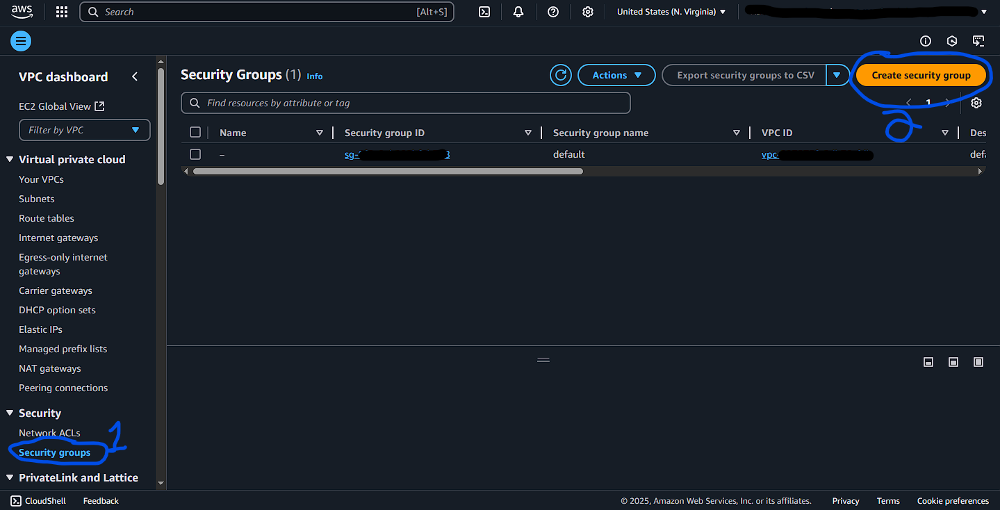


**2.1.3** - Nas configurações selecione:
- **Security group name**: defina um nome para o security group
- **Description**: breve descrição
- **VPC**: selecione a VPC criada anteriormente

**Inbound rules**
- Tipo: `SSH`, Protocolo: `TCP`, Porta: `22`, Origem: `My IP`
- Tipo: `HTTP`, Protocolo: `TCP`, Porta: `80`, Origem: `Anywhere - IPv4`
- Tipo: `NFS`, Protocolo: `TCP`, Porta: `2049`, Origem: `Anywhere - IPv4`"

**Outbound rules**
- Tipo: `All traffic`, Destino: `Anywhere - IPv4`

Clique em **Create security group**

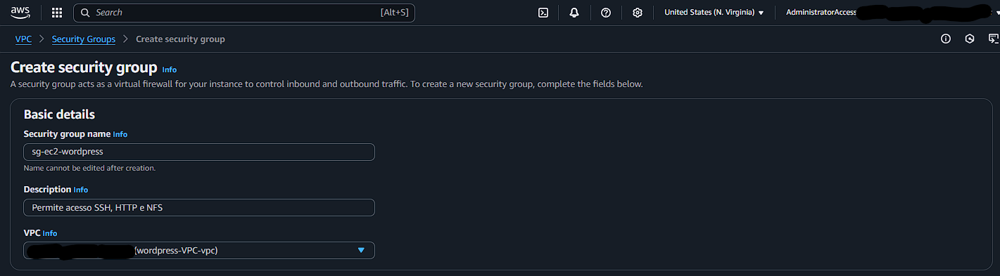
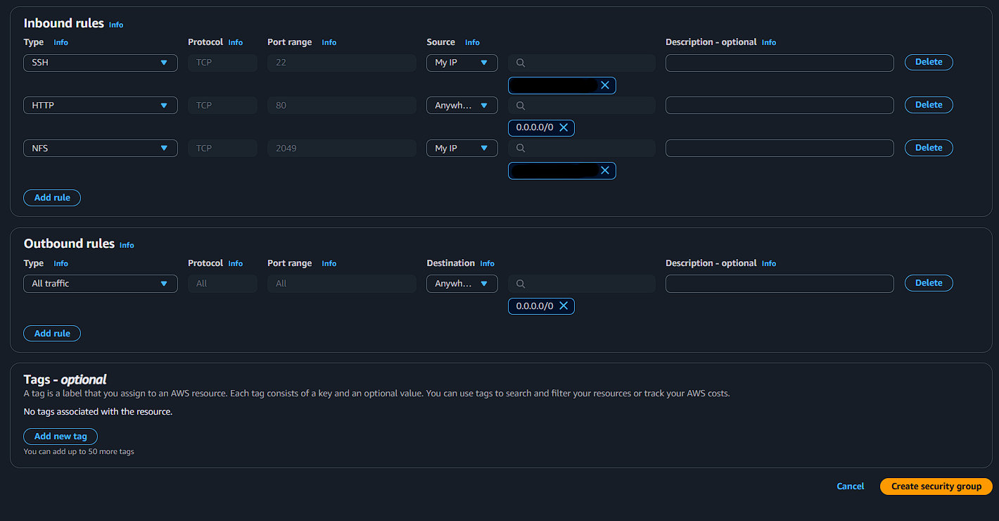

---

#### **2.2** Security Group do RDS (banco de dados)

**2.2.1** - Repita os passos **2.1.1** e **2.1.2**

**2.2.2** - Nas configurações selecione:
- **Security group name**: defina um nome para o security group
- **Description**: breve descrição
- **VPC**: selecione a mesma VPC usada na EC2

**Inbound rules**
- Tipo: `MySQL/Aurora`, Protocolo: `TCP`, Porta: `3306`, Origem:  selecione o **Security Group da EC2**

**Outbound rules**
- Tipo: `All traffic`, Destino: `Anywhere - IPv4`

Clique em **Create security group**

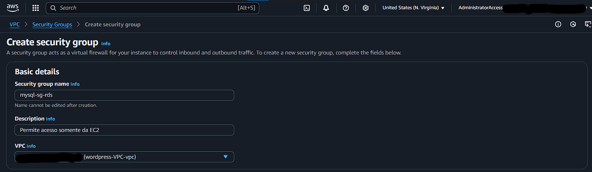
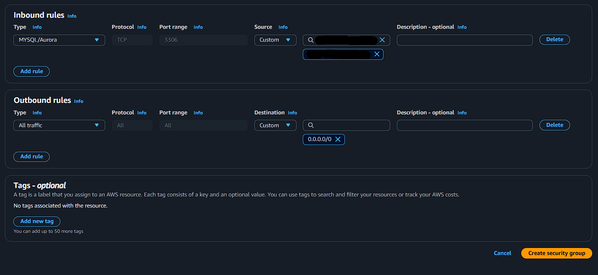

---

### 3. Criar EFS (Elastic File System)

**3.1** - Abra o console e pesquise por **EFS** na aba de pesquisa

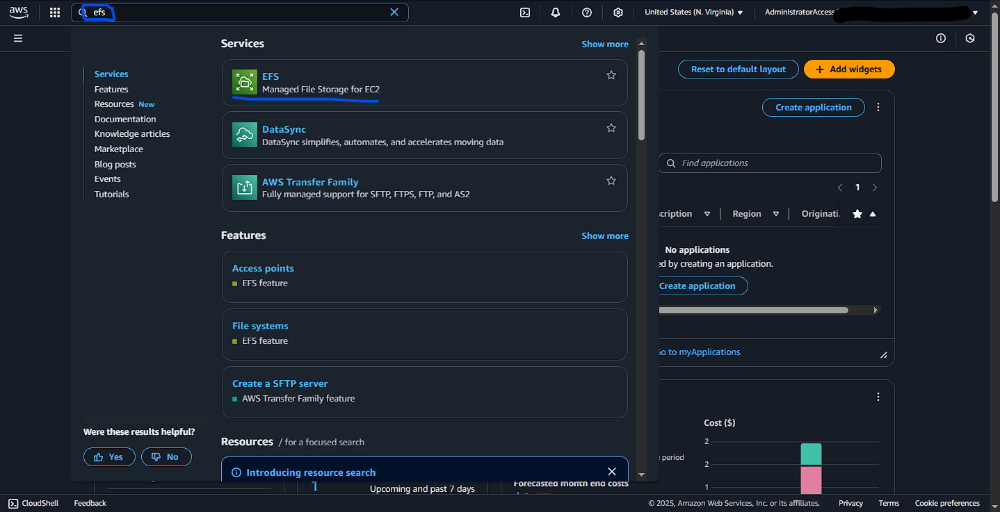

**3.2** - No menu ao lado esquerdo clique em **File systems**, depois em **Create file system** na parte superior direita

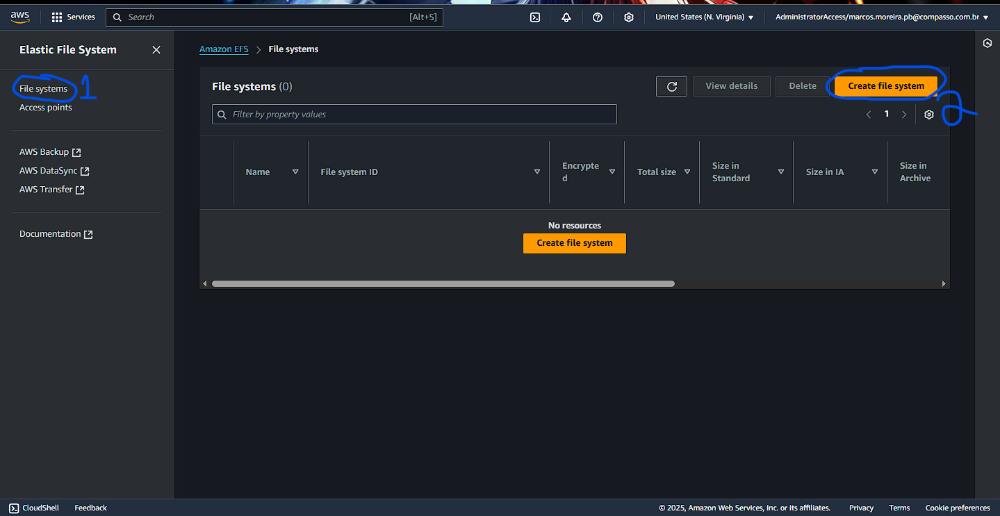

**3.3** - Configure o sistema de arquivos
- **Name**: defina um nome para o EFS
- **VPC**: selecione a VPC usada na EC2

Clique em **Create file system**.

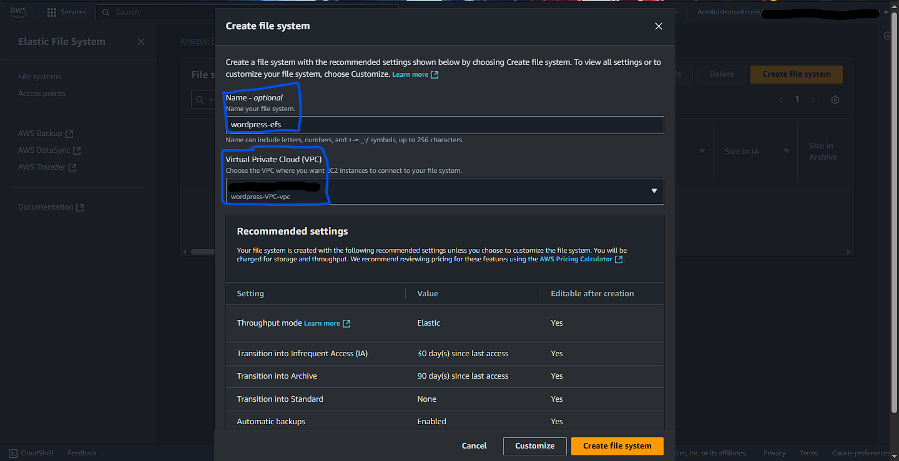

**3.4** - Clique no nome do EFS recém-criado para acessar os detalhes


**3.5** - Copie o valor do campo **DNS name**

> ℹ️ Esse será o caminho usado para montar o EFS na instância EC2 via NFS. Guarde essa informação — ela será usada nos próximos passos.

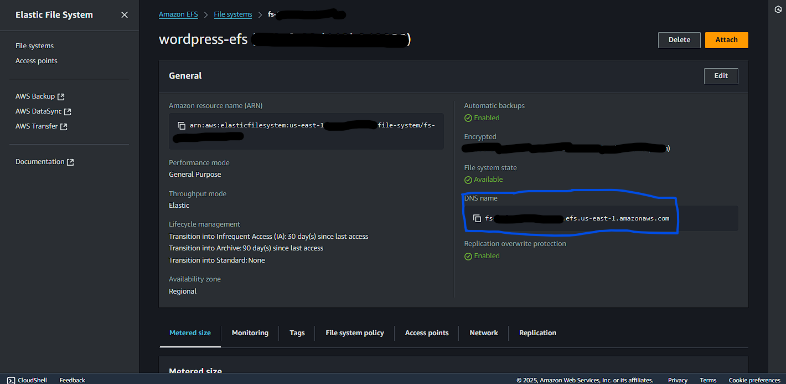

---

### 4. Criar RDS (Relational Database Service)

**4.1** - Abra o console e pesquise por **RDS** na aba de pesquisa

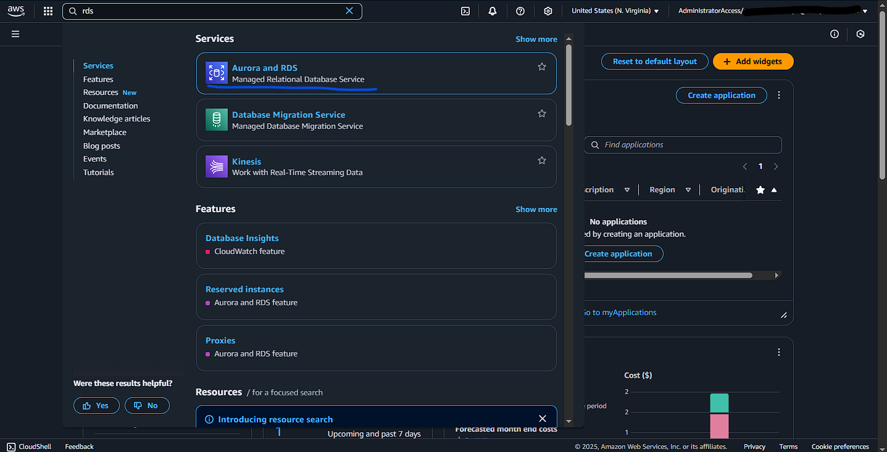

**4.2** - No menu ao lado esquerdo clique em **Databases**, depois em **Create database** na parte superior direita

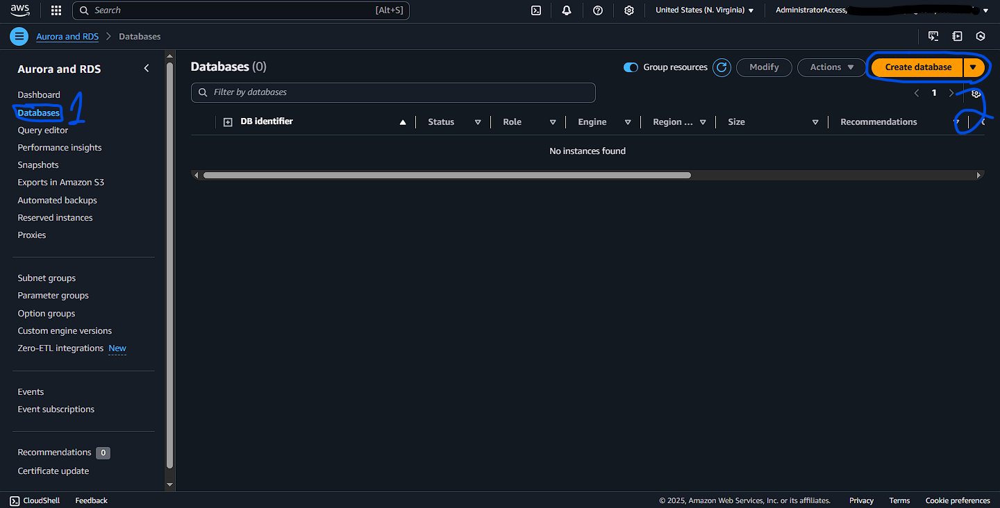

**4.3** - Configure o banco de dados (RDS)

> ℹ️ Esta seção é extensa e com muitos campos, listei apenas as configurações essenciais. As demais opções podem ser deixadas como padrão (default). Não incluímos imagens aqui para evitar sobrecarga visual, já que o processo é autoexplicativo se lido com atenção.

- **Choose a database creation method**: selecione **Standard create**
- **Engine options**: selecione **MySQL**
- **Templates**: selecione **Free tier**
- **Deployment options**: selecione **DSingle-AZ DB instance deployment (1 instance)**
- **DB instance identifier**: defina um nome para seu banco
- **Master username**: defina o nome do usuário
- **Credentials management**: selecione **Self managed**
- **Master password**: defina uma senha para seu banco
- **DB instance class**: selecione **db.t3.micro**
- **Storage type**: selecione **gp3**
- **Allocated storage**: selecione **20**
- **Maximum storage threshold**: selecione **30**
- **Virtual private cloud (VPC)**: selecione a VPC usada na EC2 e demais
- **VPC security group (firewall)**: selecione o security criado para o banco de dados
- Em "Additional configuration" > **Initial database name**: crie um nome inicial para priemira "tabela"

Clique em **Create database**

**4.4** - Clique no nome do banco de dados recém-criado para acessar os detalhes


**4.5** - Copie o valor do campo **Endpoint**

> ℹ️ Esse será o caminho usado para conectar a aplicação do wordpress ao banco de dados.


---

### 5. Criar instância EC2

**5.1** - Abra o console e pesquise por **EC2** na aba de pesquisa

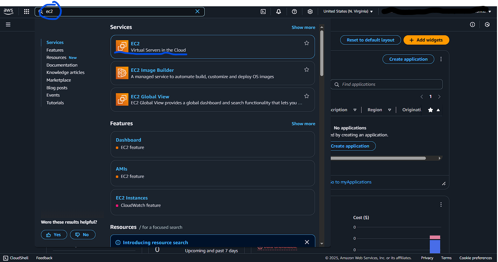

**5.2** - No menu ao lado esquerdo clique em **Instances**, depois em **Launch instances** na parte superior direita

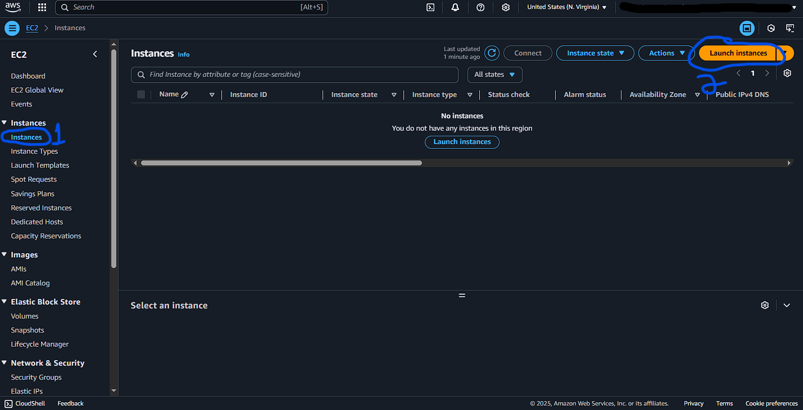

**5.3** - Nas configurações:
- **Name and tags**: coloque tags para identificação
- **Application and OS Images**: escolha sua imagem (estou usando Ubuntu)
- **Instance type**: selecione **t2.micro**
- **Key pair (login)**: selecione **Create new key pair**
    - **Key pair name**: dê um nome para key pair
    - **Key pair type**: selecione **RSA**
    - **Private key file format**: selecione **.pem**
- **Firewall (security groups)**: selecione **Select existing security group**
- **Common security groups**: selecione o security group criado para EC2
- **VPC - required**: selecione a VPC já criada
- **Subnet**: escolha uma subnet publica
- **Auto-assign public IP**: selecione **Enable**

Clique em **Launch instance**

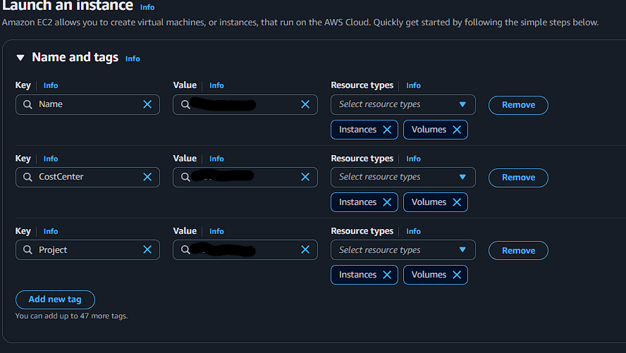
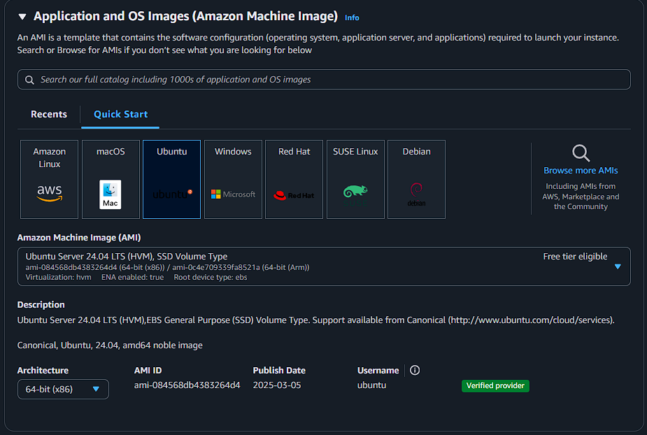
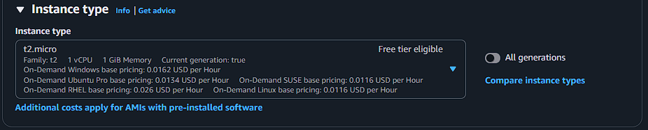
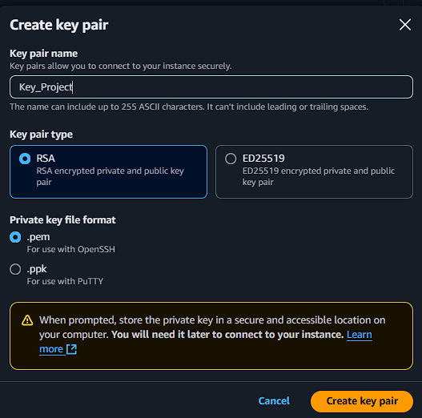
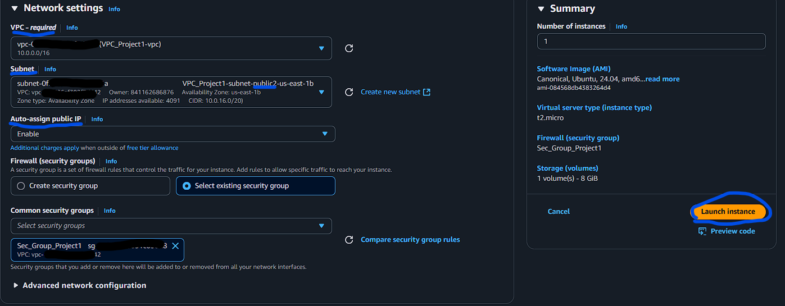

---

### 6. Conectar a EC2 (utilizando Git Bash - pelo windows)

**6.1** - Obter o IP público da sua instância
- Você pode obte-lo na tela de instâncias
- Pesquise por EC2
- No menu esquerdo selecione "Instances"
- Selecione a instância criada e veja o IP em "Details"

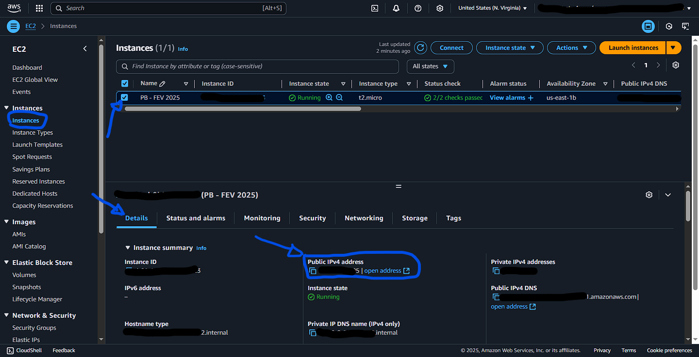

**6.2** - Estabelecendo conexão

Na criação da "Key pair" o sistema já faz o download dela, no caso do windows ela vai para o diretório padrão de downloads, mas você pode move-la se preferir. (É necessário ter o Git instalado)
- Na pasta onde se encontra a sua chave clique com o botão direito e selecione "Open Git Bash here"
- Com o terminal do Git aberto digite o seguinte código (alterando o nome da chave e o ip)
```bash
ssh -i NOME_DA_CHAVE ubuntu@MEU_IP
```


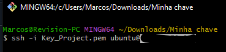

---

### 7. Configurando o ambiente

Devemos iniciar atualizando os pacotes na máquina, e depois instalar dependências, como o docker e o montador. Por fim criar a aplicação do wordpress via docker-compose e roda-la.

**7.1** - Instalando dependências e fazendo montagem

Rode os seguintes comandos:

```bash
sudo apt update && sudo apt upgrade -y
sudo apt install -y nfs-common
sudo apt install -y docker.io
```
```bash
sudo systemctl enable docker
sudo systemctl start docker
```
```bash
sudo curl -SL https://github.com/docker/compose/releases/download/v2.35.1/docker-compose-linux-x86_64 -o /usr/local/bin/docker-compose
sudo chmod +x /usr/local/bin/docker-compose
```

> ℹ️ Se necessário você pode instalar uma versão atualizada do docker compose em:
 [versões-docker-compose](https://github.com/docker/compose/releases)

```bash
sudo mkdir -p /mnt/efs/
sudo mount -t nfs4 -o nfsvers=4.1 fs-XXXXXXXX.efs.REGIAO.amazonaws.com:/ /mnt/efs
sudo mkdir -p /mnt/efs/wordpress
```

> ℹ️ Substitua "fs-XXXXXXXX.efs.REGIAO.amazonaws.com" pelo **DNS name** obtido na criação do **EFS**

#### **7.2** - Criando e rodando o sua aplicação

Rode os seguintes comandos para criar uma pasta para os arquivos e acessa-la

```bash
sudo mkdir -p /home/ubuntu/app-wordpress
cd /home/ubuntu/app-wordpress
```

**7.2.1** - Criando o arquivo compose

Crie seu compose.yml

```yml
services:
  wordpress:
    image: wordpress:latest
    container_name: wordpress
    restart: always
    ports:
      - "80:80"
    environment:
      WORDPRESS_DB_HOST: ${WORDPRESS_DB_HOST}
      WORDPRESS_DB_USER: ${WORDPRESS_DB_USER}
      WORDPRESS_DB_PASSWORD: ${WORDPRESS_DB_PASSWORD}
      WORDPRESS_DB_NAME: ${WORDPRESS_DB_NAME}
    volumes:
      - /mnt/efs/wordpress:/var/www/html
```

**7.2.2** - Criando o arquivo de configuração

Crie seu .env

```env
WORDPRESS_DB_HOST="seu-endpoint-rds.amazonaws.com":3306
WORDPRESS_DB_USER="nome de usuário"
WORDPRESS_DB_PASSWORD="senha"
WORDPRESS_DB_NAME="nome da tabela"
```

> ℹ️ Substitua pelos dados usados na criação do banco de dados

**7.2.3** - Rodando a aplicação

Sem sair da pasta onde estão os arquivos digite:

```bash
sudo docker-compose up -d
```

Para verificação, abra a página web no navegador utilizando o IP público da sua EC2, exemplo: 
http://SeuIP

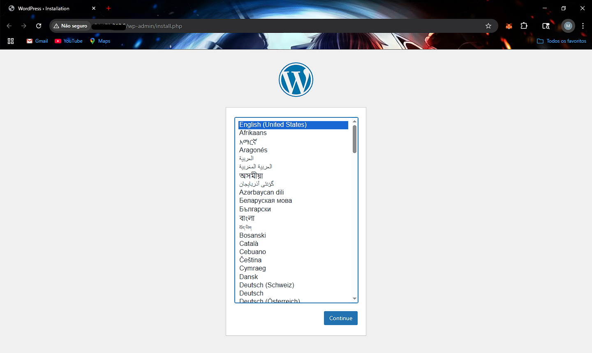

---

## 📌 Considerações finais
Realizar o deploy manual do WordPress na AWS, utilizando serviços como EC2, RDS, EFS e Security Groups personalizados, é uma excelente forma de entender os fundamentos da infraestrutura em nuvem. Essa abordagem proporciona uma visão prática e completa de como os serviços da AWS se integram para formar um ambiente escalável, seguro e de alta disponibilidade.
Apesar de exigir mais tempo e atenção aos detalhes, esse processo ajuda a fixar conceitos importantes como isolamento de rede, regras de segurança, montagem de volumes persistentes e conexão com bancos de dados gerenciados.
Em resumo, esse tipo de configuração manual é ideal para estudos e aprendizado, permitindo que você ganhe domínio sobre cada etapa do processo — algo essencial para quem deseja atuar com DevOps, Cloud Computing ou Arquitetura de Soluções.