# 📘 WordPress na AWS (com Load Balancer e Auto Scaling)

Este ambiente em nuvem permite rodar o WordPress com RDS (MySQL) usando EC2 + Docker Compose + EFS, com suporte a Load Balancer e Auto Scaling. Utilizando um script via **User Data**, a instância já inicia com a aplicação WordPress funcional.

---

## ✅ Objetivos

- Subir ambiente WordPress de forma escalável com Auto Scaling Group e Load Balancer.
- Montar volumes persistentes com EFS.
- Utilizar `.env` para parametrização do banco de dados (RDS).
- Automatizar configuração via User Data em instâncias EC2.
- Acessar a tela de login do WordPress via **DNS do Load Balancer**.

---

## 🧾 Pré-requisitos

- Conta AWS com permissões para EC2, EFS, RDS, IAM, VPC, Load Balancer.
- Conhecimentos básicos em terminal Linux e Docker.
- Chave PEM de acesso à instância EC2.
- MySQL RDS e EFS já criados e acessíveis.

---

## 📁 Estrutura de Arquivos
```sql
📁 3-userdata
│
├── 📁 img                      # Imagens e capturas de tela do projeto
├── docker-compose.yml          # Compose do WordPress
├── .env                        # Variáveis de ambiente para banco de dados
├── user-data.sh                # Script de inicialização EC2 (User Data)
└── README.md                   # Este arquivo
```

---

## 🧠 Conceitos Utilizados

### Auto Scaling Group
- Garante que a aplicação se mantenha disponível mesmo com mudanças na demanda. Ele cria novas instâncias EC2 automaticamente quando há muito acesso e remove as que não estão sendo usadas para economizar recursos.

### Load Balancer
- Distribui o tráfego entre as instâncias disponíveis, evitando sobrecarga em apenas uma delas. Assim, melhora o desempenho e a estabilidade da aplicação.

---

## ⚙️ Pimeiras considerações e teste de script

Espera-se que a VPC, os Security Groups, o banco de dados (RDS) e o gerenciador de arquivos (EFS) já estejam criados. Caso contrário, realize até o **Passo** 4 da seguinte documentação: [Iniciando-AWS](/2-manual-aws/README.md)

### Testando script

Vamos seguir o **Passo 5**: [Iniciando-AWS](/2-manual-aws/README.md). Porém ao final, em **Advanced details > User data - optional**, cole o script. Após a criação da instância, a aplicação WordPress já estará funcionando sem necessidade de configuração manual.

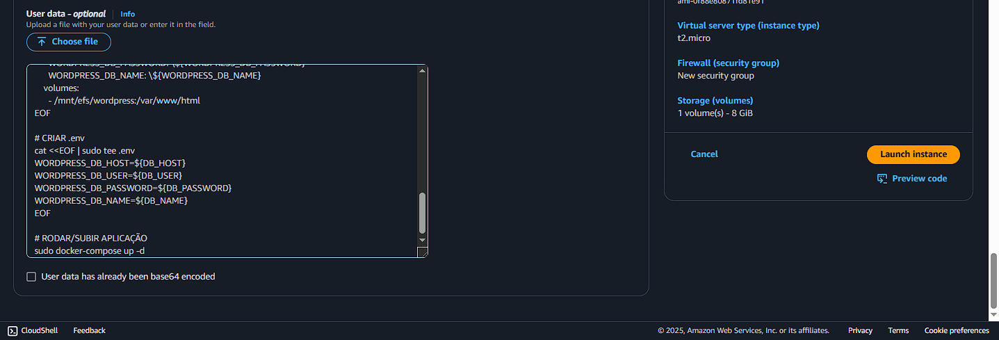

### Testando persistência de dados

Após configurar um post no WordPress, acesse a instância criada e execute os seguintes comandos para simular uma reinicialização da aplicação:

```bash
docker-compose down
docker-compose up -d
```


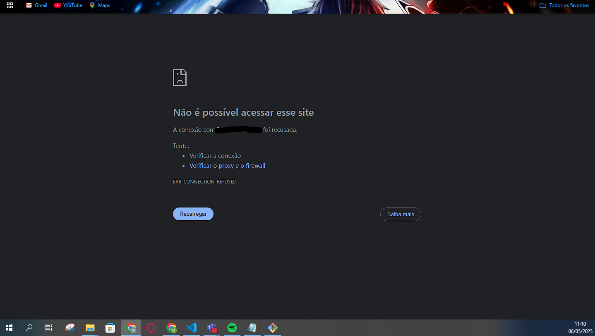
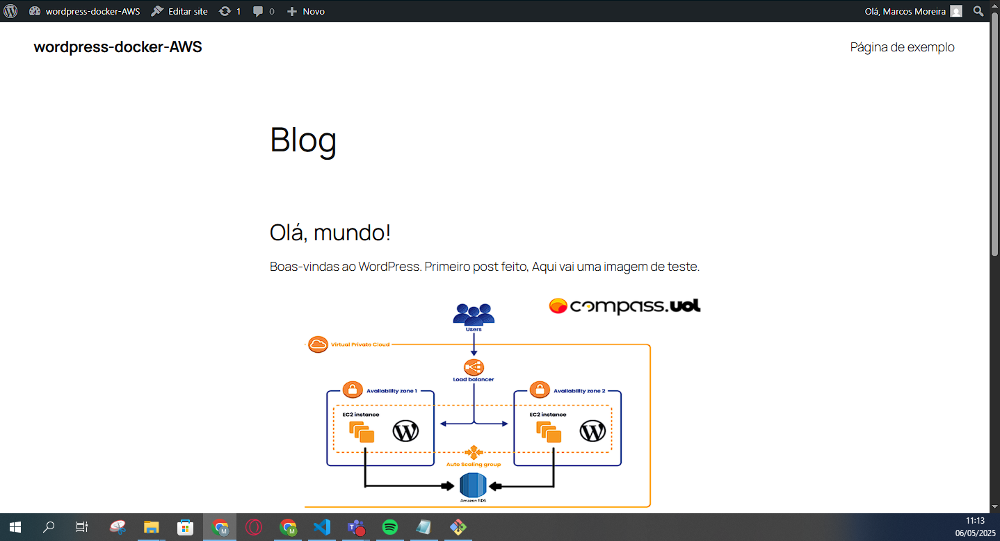

Através do horário mostrado nas imagens, é possível observar que a aplicação ficou fora do ar por um tempo, mas ao ser reiniciada os dados permaneceram — inclusive imagens — devido ao uso do **EFS**.

---

## 🚀 Passo a passo

### 1. Criar e configurar os Security Goups

**1.1** - Security Group para o Load Balancer
- **Security group name**: defina um nome para o security group
- **Description**: breve descrição
- **VPC**: selecione a VPC já criada

**Inbound rules**
- Tipo: `HTTP`, Protocolo: `TCP`, Porta: `80`, Origem: `Anywhere - IPv4`

**1.2** - Ajustar o **Security Group** da EC2

**Inbound rules**
- Remova a regra "HTTP (porta 80)"
- Crie uma nova: Tipo: `HTTP`, Protocolo: `TCP`, Porta: `80`, Origem: `Selecione o security group do load balancer`

### 2. Criar o Application Load Balancer (LB)

**2.1** - Abra o console e pesquise por **LOAD BALANCER** na aba de pesquisa, selecione **Create load balancer**

**2.2** - Configurações

> ℹ️ Listei apenas as configurações essenciais. As demais opções podem ser deixadas como padrão (default). Não incluímos imagens aqui para evitar sobrecarga visual, já que o processo é autoexplicativo se lido com atenção.

- Escolha **Application Load Balancer** para iniciar a criação
- **Load balancer name**: defina um nome para o **ALB**
- **Scheme**: selecione **Internet-facing**
- **VPC**: selecione a VPC já criada
- **Availability Zones and subnets**: selecione as 2 Subnets públicas
- **Security groups**: selecione o security group criado para o **ALB**
- **Default action**: selecione **Create target group**
    - **Choose a target type**: selecione **Instances**
    - **Protocol:Port**: selecione **HTTP** e **80**
    - **Health check protocol**: selecione **HTTP**
    - **Health check path**: selecione "**/**"
    - **Healthy threshold**: **2**
    - **Health check port**: **Traffic port**
    - **Unhealthy threshold**: **2**
    - **Timeout**: **5**
    - **Interval**: **30**
    - **Success codes**: **200-399**

    Avance e clique em **Creat target group**
- Selecione o **target group** criado

Clique em **Create load balancer**

> Parâmetros do Health Check
>- Tipo: HTTP
>- Porta: 80
>- Path (Caminho): / (raiz — página inicial do WordPress)
>- Healthy threshold: 2
>   - A instância será marcada como saudável após 2 respostas bem-sucedidas consecutivas.
>- Unhealthy threshold: 2
>   - A instância será considerada instável após 2 falhas consecutivas.
>- Timeout: 5 segundos
>   - Tempo máximo para o WordPress responder.
>- Interval: 30 segundos
>   - Frequência com que o health check será realizado.
>- Success codes: 200-399
>   - Faixa de códigos HTTP considerados como sucesso.
>       - 2xx: Respostas bem-sucedidas
>       - 3xx: Redirecionamentos válidos

---

### 3. Criar um launch templates

O Launch Template define como suas instâncias EC2 serão criadas automaticamente. O processo de criação é quase o mesmo da criação de uma instância EC2.

**3.1** - Abra o console e pesquise por **LAUNCH TEMPLATES** na aba de pesquisa, selecione **Create launch template**

**3.2** - Configurações
- **Launch template name**: defina um nome para o **template**
- **Application and OS Images**: selecione **Ubuntu**
- **Instance type**: selecione **t2.micro**
- **Key pair (login)**: selecione a Key pair já criada
- **Network settings**: Deixe em branco (será configurado no Auto Scaling)
- **Firewall (security groups)**: selecione **Select existing security group**
- **Common security groups**: selecione o security group criado para EC2
- **Resource tags**: coloque tags para identificação
- **Advanced details > User data - optional**: cole o script

Clique em **Create launch template**

---

### 4. Criar o Auto Scaling Group

**4.1** - Abra o console e pesquise por **AUTO SCALING GROUPS** na aba de pesquisa, clique em **Create Auto Scaling Group**

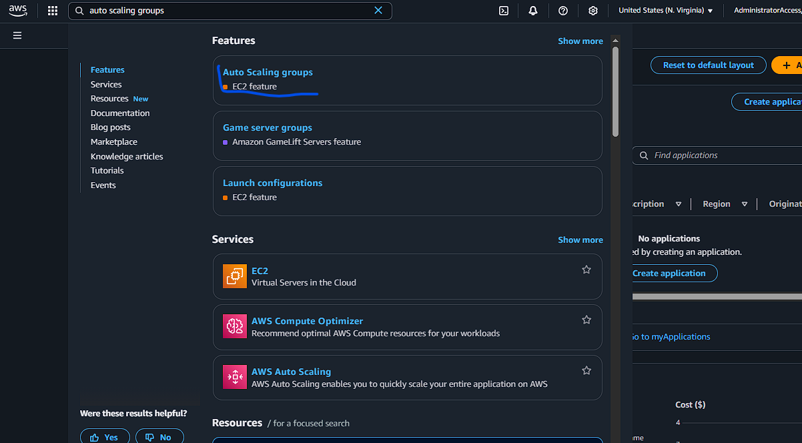
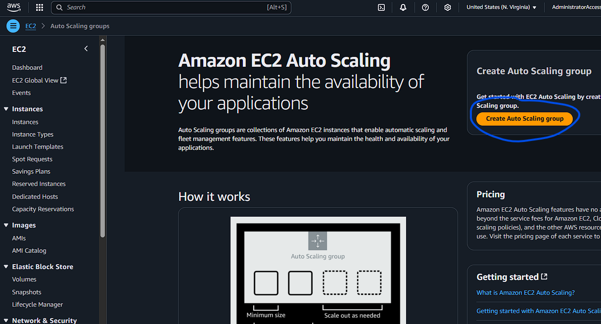

**4.2** - Configurações
- **Auto Scaling group name**: defina um nome para o **Auto Scaling group**
- **Launch template**: selecione o template criado

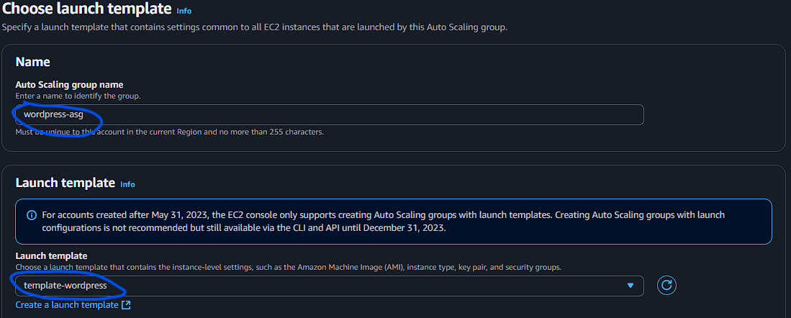

> Next

- **VPC**: selecione a **VPC** já criada
- **Availability Zones and subnets**: selecione as **Subnets privadas**

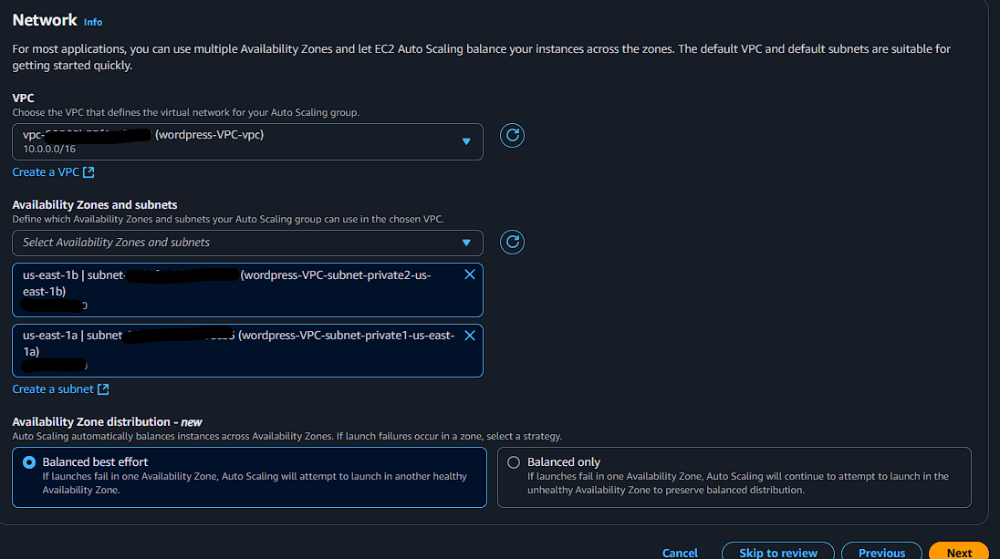

> Next

- **Load balancing**: selecione **Attach to an existing load balancer**
- **Attach to an existing load balancer**: selecione **Choose from your load balancer target groups**
    - Escolha o **target group** já criado
- **Additional health check types**: selecione **Turn on Elastic Load Balancing health checks**

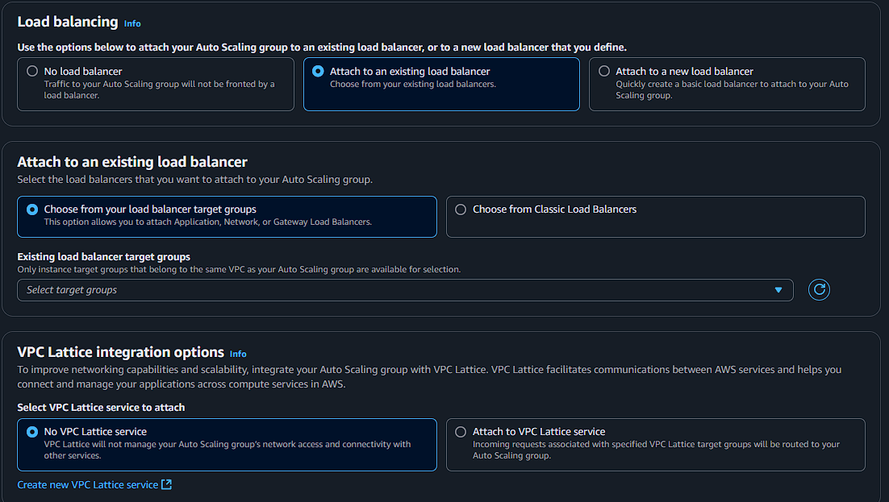
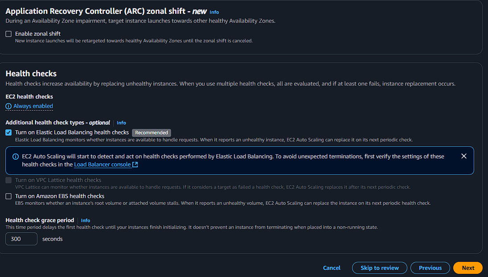

> Next

- **Group size** e **Scaling** - Aqui você define a quantidade de instâncias que deseja que estejam rodando, a capacidade mínima e máxima, e quais políticas para definir quando deve-se "criar" ou "destruir" uma instância.

> Estou utilizando 2 como desejada, 1 para mínimo e 3 para máximo, a política de scaling é que se a utilização do CPU ultrapassar 75% deve-se lançar outra instância.

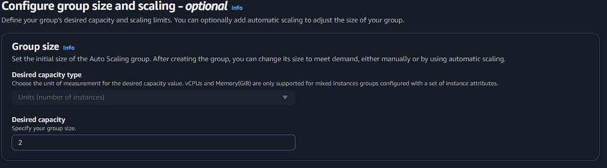
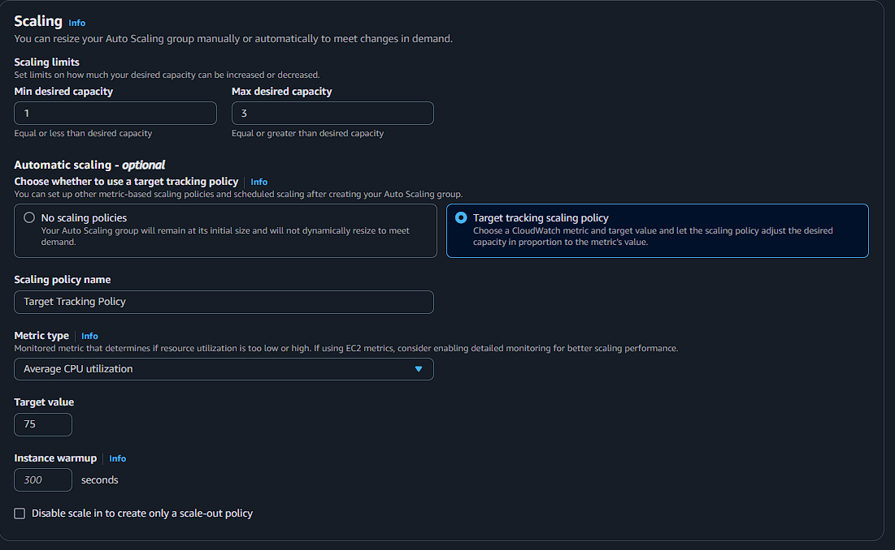

> Next

> Next

> Next

Clique em **Create Auto Scaling group**

Assim que o **Auto Scaling group** for criado, ele começará a criar as instâncias, para testar se elas estão rodando corretamente espere um pouco até que sejam iniciadas e vá até o a tela do **load balancer** e clique no nome do "ALB" que você criou. 

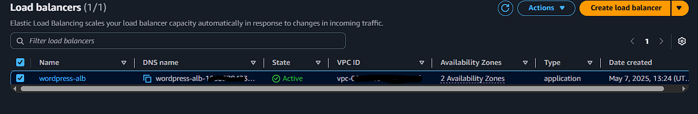
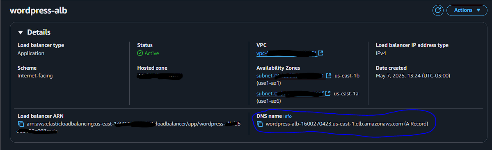

Na tela procure por "**DNS name**", copie e cole no no navegador, e deverá aparecer a tela de login do wordpress. Agora basta configurar.

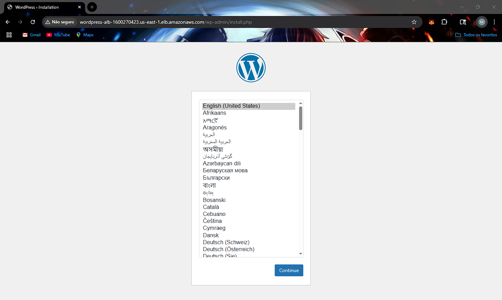

---

## 🧪 Testes

Após configurado o ambiente e criado um post, podemos acessar novamente utilizando o DNS, vamos acessar em uma página anônima para ver como ficou.

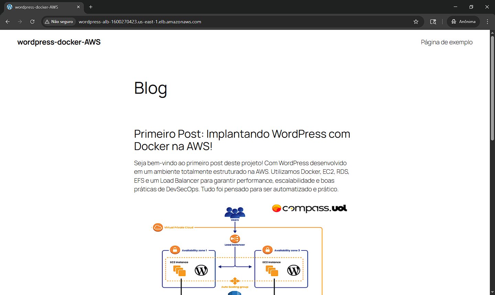

**Target Groups**

Ao acessar o target group vimos que há uma instância rodando, e seu status de "**Healthy**", ou seja, esta instância está funcionando corretamente. Lembrando que o padrão para que ela seja considerada "**Unhealthy**", é a página retornando código HTTP que não esteja entre 200 e 399.
Temos apenas uma instância rodando no momento.

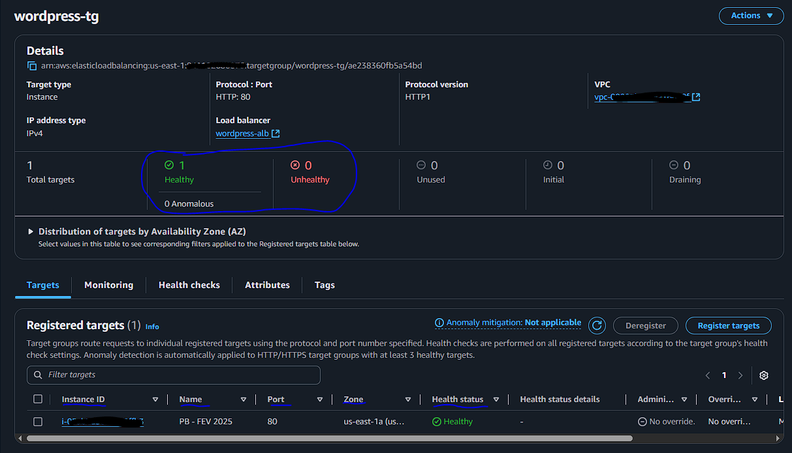

**Auto Scaling Groups**

Na criação no **ASG** colocamos como desejado **2** instâncias, porém elas podem variar de 1 a 3 dependendo da utilização da **CPU**, se por um acaso tivermos muitos acessos e a utilização do **CPU** ultrapassar o especificado (75%), uma nova instância será criada.

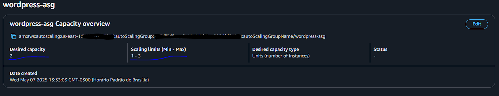

**Load Balancer**

Caso mais de uma instância esteja ativa, é papel do load **balancer** redirecionar os acessos entre elas, não deixando que uma instância fique muito mais sobrecarregada que a outra.

### Testando persistência de dados e **ASG**

Na página de instâncias no console da AWS veremos a EC2 criada pelo **ASG**, vamos derruba-la manualmente e ver que o nosso wordpress não estará mais disponível, porém o auto scaling deverá criar uma nova EC2, já que não pode-se ter menos de uma em funcionamento.


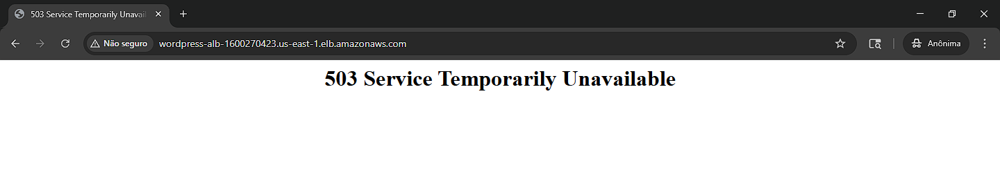
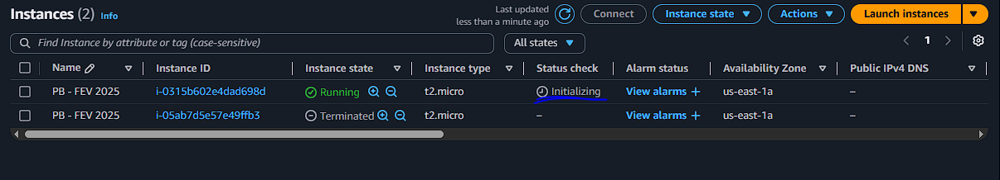

Ao acessar novamente a página do Wordpress através, veremos que ela se encontra em funcionamento novamente, e que as configurações e arquivos (imagem), também estão lá, confirmando assim a persistência dos dados.

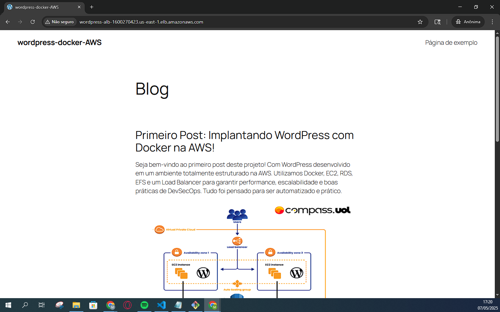

---

## 📌 Considerações Finais
Neste projeto, foi possível provisionar um ambiente completo e escalável para o WordPress utilizando serviços gerenciados da AWS. Exploramos conceitos fundamentais de infraestrutura moderna, como:

- Deploy com Docker em instâncias EC2
- Banco de dados gerenciado com RDS
- Armazenamento compartilhado com EFS
- Balanceamento de carga com ALB
- Alta disponibilidade com Auto Scaling Groups

O ambiente está pronto para suportar variações de tráfego, mantendo a aplicação sempre disponível e com dados persistentes.