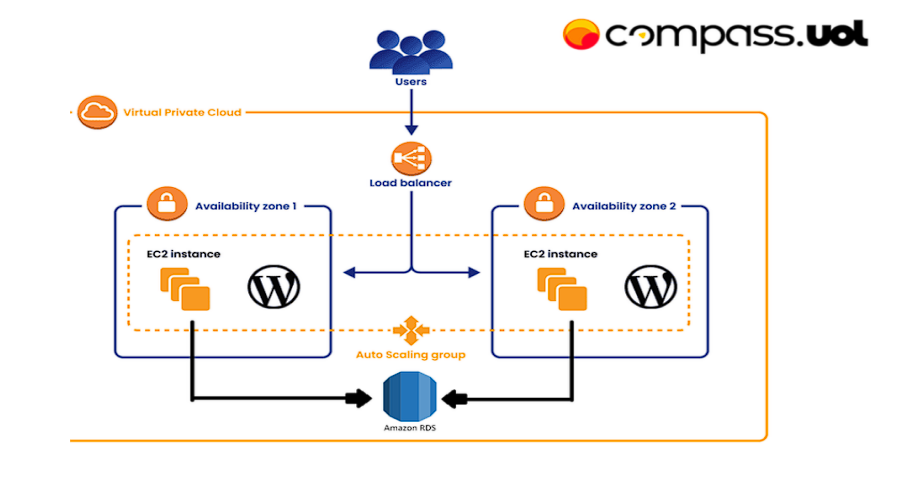

# Projeto WordPress na AWS — Níveis de Automação com Docker e Infraestrutura em Nuvem

## 🧭 Contexto

Este projeto foi desenvolvido como parte do **Programa de Bolsas DevSecOps da Compass.UOL**, com o objetivo de consolidar conhecimentos em AWS, Docker e práticas de automação de infraestrutura. A proposta principal é implantar um ambiente completo com WordPress rodando em uma instância EC2, dentro de uma VPC, utilizando serviços como RDS, EFS e Load Balancer.

## 🎯 Objetivo da Atividade

Realizar o deploy de uma aplicação WordPress na AWS com os seguintes requisitos:

- Execução do WordPress em uma instância EC2 com Docker
- Banco de dados MySQL hospedado via Amazon RDS
- Utilização do Amazon EFS para armazenar arquivos estáticos do WordPress
- Controle de acesso externo via AWS Load Balancer (sem uso de IP público direto)
- Infraestrutura dentro de uma VPC
- Aplicação acessível pela porta 80 ou 8080
- Versionamento no GitHub e documentação completa

## ✍️ Escolha de Abordagem

Com o intuito de desenvolver uma visão prática e progressiva sobre a criação de ambientes na nuvem, **optei por dividir o projeto em quatro etapas**, representando diferentes níveis de automação e complexidade. Tendo como objetivo organizar minha linha de raciocínio e demonstrar, de forma clara, minha evolução no desenvolvimento do ambiente.

Cada etapa representa uma forma diferente de abordar o mesmo objetivo — do ambiente local até uma infraestrutura totalmente automatizada com CloudFormation.

## 📁 Estrutura do Repositório

O repositório está dividido em quatro pastas:

```sql
📁 compass-wordpress-docker-on-aws
│
├── 📁 1-local
│   └── Ambiente local com Docker Compose e banco em container
│
├── 📁 2-manual-aws
│   └── Instâncias criadas manualmente na AWS (EC2, RDS, EFS), sem automação
│
├── 📁 3-userdata
│   └── Instâncias criadas com User Data e scripts automatizando parte da configuração
│
├── 📁 4-cloudformation
│   └── Infraestrutura totalmente automatizada via AWS CloudFormation
│
└── README.md (este arquivo)
```

## ⚙️ Tecnologias e Serviços Utilizados

- **Amazon EC2**
- **Docker / Docker Compose**
- **Amazon RDS (MySQL)**
- **Amazon EFS**
- **AWS Load Balancer**
- **VPC, Subnets, Security Groups**
- **CloudFormation**
- **Shell Script (User Data)**
- **Git e GitHub**

## 📄 Resumo das Etapas

### [`1-local/`](./1-local/README.md)
Simulação do ambiente em máquina local usando Docker Compose para WordPress e banco MySQL. Etapa inicial para validar funcionamento da aplicação.

### [`2-manual-aws/`](./2-manual-aws/README.md)
Ambiente na AWS configurado manualmente:
- EC2 criada via console
- Docker instalado manualmente
- Banco RDS e EFS configurados via AWS Console
- Sem scripts ou automação

### [`3-user-data/`](./3-user-data/README.md)
Automação parcial com `user_data.sh`:
- Instalação automática do Docker na inicialização da EC2
- Deploy do WordPress automatizado
- Recursos como RDS e EFS ainda configurados via console

### [`4-cloudformation/`](./4-cloudformation/README.md)
Ambiente 100% automatizado via AWS CloudFormation:
- VPC, subnets, EC2, RDS, EFS, SGs, Load Balancer e deploy do WordPress
- Reproduzível com um clique

## 🖼️ Topologia Referencial



## 📚 Instruções

Cada pasta contém um `README.md` com:
- Etapas detalhadas de execução
- Recursos utilizados
- Screenshots (se necessário)
- Testes e validações

---

Este projeto reflete não apenas a implementação técnica, mas também minha forma de pensar, organizar e aprender de forma prática durante o Programa de Bolsas da Compass.UOL.